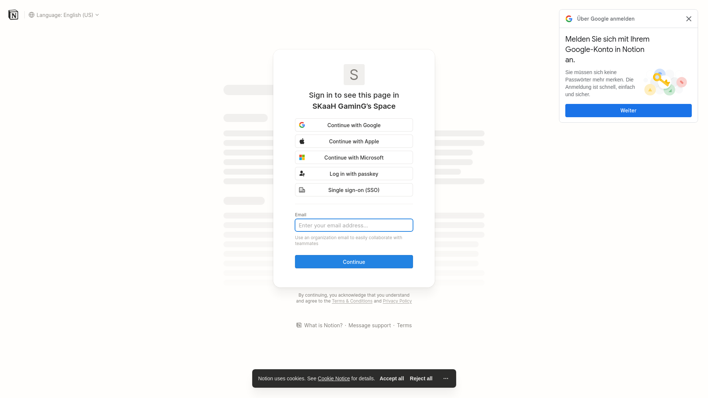
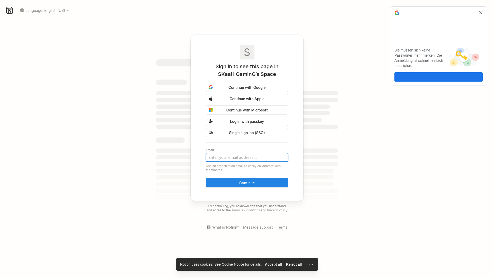

# 📚 Notion Student Planner - Etsy Templates

[](https://github.com/skaah)
[](https://notion.so)
[](https://etsy.com)

> 🎓 **8 Templates Notion pour Étudiants** - Multilingue & Optimisés pour Etsy

---

## 🌍 Versions Linguistiques

| Langue | Drapeau | Statut | Screenshot |
|--------|---------|--------|------------|
| 🇫🇷 Français | FR | ✅ Complète | [Voir](#-français) |
| 🇪🇸 Español | ES | ✅ Complète | [Voir](#-español) |
| 🇩🇪 Deutsch | DE | ✅ Complète | [Voir](#-deutsch) |
| 🇵🇹 Português | PT | ✅ Complète | [Voir](#-português) |
| 🇮🇹 Italiano | IT | ✅ Complète | [Voir](#-italiano) |
| 🇳🇱 Nederlands | NL | ✅ Complète | [Voir](#-nederlands) |
| 🇷🇺 Русский | RU | ✅ Complète | [Voir](#-русский) |
| 🇬🇧 English | EN | ✅ Complète | - |

---

## 📸 Screenshots

### 🇫🇷 Français


### 🇪🇸 Español


### 🇩🇪 Deutsch


### 🇵🇹 Português


### 🇮🇹 Italiano


### 🇳🇱 Nederlands


### 🇷🇺 Русский


---

## 📁 Fichiers Disponibles

### 📝 Listings Etsy
**Fichier:** `etsy_listings.txt`

Contenu pour chaque langue:
- ✅ Titre optimisé SEO (140 caractères max)
- ✅ Description complète avec emojis
- ✅ 13 tags stratégiques
- ✅ Prix recommandé par marché
- ✅ Structure des 7 bases de données

### 🎨 Spécifications Visuelles
**Fichier:** `etsy_images_specs.txt`

Guide pour créer 10 images par langue:
1. 📸 Image principale (Hero) - 3000x3000px
2. 🎬 GIF animé de navigation
3. 📱 Vue mobile responsive
4. 📅 Emploi du temps / Schedule
5. 📝 Devoirs / Assignments
6. 📈 Suivi des notes / Grades
7. 💰 Budget étudiant
8. 🗒️ Notes de cours
9. ❓ Instructions d'utilisation
10. ✨ Avant/Après transformation

**Palettes de couleurs nationales incluses**

### 📱 Marketing Réseaux Sociaux
**Fichier:** `marketing_social_media.txt`

Contenu prêt à publier:
- 📷 Posts Instagram (8 langues)
- 🎵 Scripts TikTok avec timings
- 📌 Descriptions Pinterest
- 💬 Contenu VKontakte (Russie)
- 📅 Calendrier de publication
- 🏷️ Hashtags stratégiques par langue

---

## 💰 Stratégie de Prix

| Langue | Prix Recommandé | Marché |
|--------|-----------------|--------|
| 🇫🇷 FR | €16.99 | Premium |
| 🇪🇸 ES | €15.99 | Grand marché |
| 🇩🇪 DE | €17.99 | Premium |
| 🇵🇹 PT | €13.99 | Émergent |
| 🇮🇹 IT | €14.99 | Croissance |
| 🇳🇱 NL | €15.99 | Premium |
| 🇷🇺 RU | ₽1499 (~€15) | CIS |
| 🇬🇧 EN | $18.99 | Saturé |

---

## 🚀 Guide de Lancement

### Phase 1: Test (Semaine 1-2)
- [ ] Lancer 🇬🇧 EN + 🇫🇷 FR uniquement
- [ ] Collecter les 10 premiers avis
- [ ] Ajuster les prix selon la conversion

### Phase 2: Expansion (Semaine 3-4)
- [ ] Ajouter 🇪🇸 ES + 🇩🇪 DE
- [ ] Optimiser les listings
- [ ] Lancer les premières pubs

### Phase 3: Couverture Totale (Mois 2)
- [ ] Ajouter les 4 langues restantes
- [ ] Créer bundle "All Languages"
- [ ] Scale le marketing

---

## 📊 Structure des Templates

Chaque version comprend **7 bases de données**:

```
📚 Planificateur Étudiant
├── 📅 Emploi du Temps
│   └── Cours, Jours, Heures, Salles, Professeurs
├── 📝 Devoirs & Contrôles
│   └── Tâches, Statuts, Dates limites, Priorités
├── ⏱️ Sessions d'Étude
│   └── Durée, Méthodes (Pomodoro), Objectifs
├── 🧪 Examens & Notes
│   └── Dates, Coefficients, Moyennes
├── 📈 Suivi des Notes
│   └── Moyennes auto, Crédits, Validation
├── 🗒️ Centre de Notes
│   └── Tags, Liens, Organisation
└── 💰 Budget Étudiant
    └── Dépenses, Revenus, Catégories
```

---

## 🛠️ Installation

```bash
# Cloner le repo
git clone https://github.com/skaah/notion-etsy-templates.git
cd notion-etsy-templates

# Voir les listings
cat etsy_listings.txt

# Voir les specs images
cat etsy_images_specs.txt

# Voir le marketing
cat marketing_social_media.txt
```

---

## 📈 Potentiel de Revenu

### Scénario Conservateur (5 ventes/langue/mois)
```
Total mensuel: ~€605
Total 3 mois: ~€1,815
Net après frais Etsy (30%): ~€1,270
```

### Scénario Optimiste (20 ventes/langue/mois)
```
Total mensuel: ~€2,420
Total 3 mois: ~€7,260
Net après frais Etsy (30%): ~€5,080
```

---

## 🎯 Checklist Lancement Etsy

- [ ] Créer compte Etsy Seller
- [ ] Configurer Etsy Payments
- [ ] Créer politique livraison digitale
- [ ] Copier listings depuis `etsy_listings.txt`
- [ ] Créer 10 images par langue
- [ ] Configurer SEO (titre, tags, description)
- [ ] Tester processus d'achat
- [ ] Lancer marketing sur Instagram/TikTok
- [ ] Collecter premiers avis clients

---

## 📞 Support & Contact

- 💼 **Projet:** Notion Student Planner
- 👤 **Auteur:** @skaah
- 📅 **Date:** Mars 2026
- 🔗 **Repository:** https://github.com/skaah/notion-etsy-templates

---

## 📝 License

Ce projet est destiné à un usage commercial sur Etsy.
Merci de ne pas revendre les fichiers sources.

---

<p align="center">
  🎓 Bonne chance avec votre business Etsy ! 🚀
</p>
